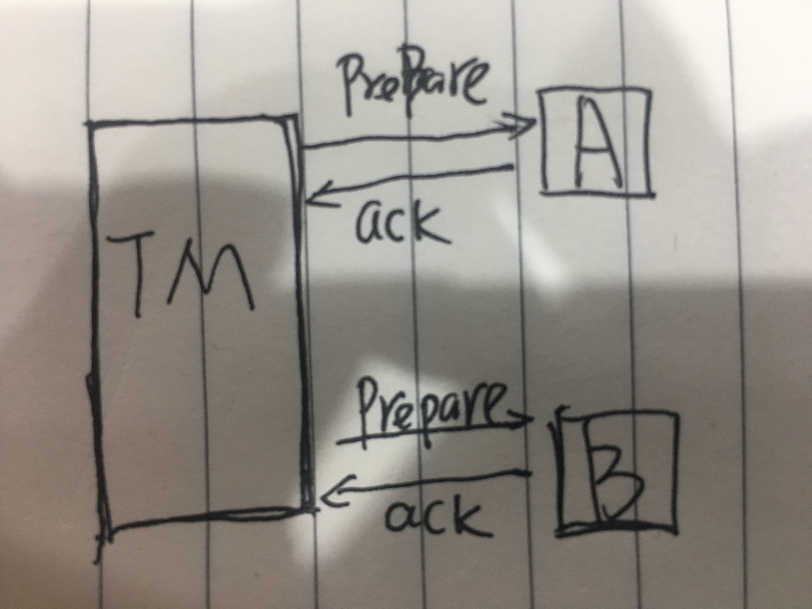
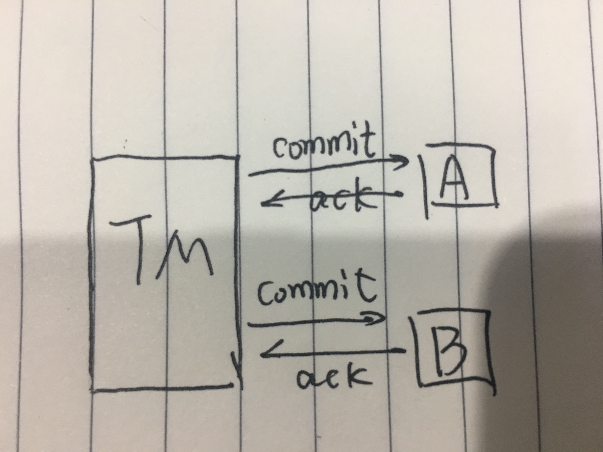

### CAP
- Consistency
- Availablity
- Partition Tolerance

#### 一致性
> 一致性，这个和数据库ACID的一致性类似，但这里关注的所有数据节点上的数据一致性
和正确性，而数据库的ACID关注的是在在一个事务内，对数据的一些约束

#### 可用性
> 每个操作总能在**一定时间**内**返回结果**。

#### 分区容忍性
> 是否可以对数据进行分区，性能和可伸缩性。

#### CAP定理
> 一个提供数据服务的的存储系统无法同时满足数据一致性、数据可用性和数据分区可容
忍性3个条件。
> 1. 若对数据进行分区，则无法同时满足一致性和数据的高可用。
> 1. 对于大型的的网站，数据规模会快速扩张，因此可伸缩性也是就是分区容忍性必不
可少，对于高并发/高可用的系统，会牺牲一部分一致性
> 应用系统需要对数据系统的不一致性进行一定的补偿和纠错，以避免应用系统出现数据
错误。

#### 数据一致性模型
分布式系统通过复制数据副本来提高系统的可靠性和高可用，并将数据副本放置到不同的
服务器上，由于维护数据一致性代价太高，许多系统会牺牲一部分一致性来提高性能。
- 强一致性。要求无论更新操作在那个副本上执行，之后所有的读操作都要获取最新的数
据。
- 弱一致性。对数据系统进行更新操作后，需要一定的时间，然后读操作才能获取到最新
的数据。
- 最终一致性。是弱一致性的一种特例，表示用户**最终**能读取到某操作对系统特定数
据的更新。

#### Quorum系统的NRW策略
该协议中有以下3个关键字N、R、W
- N表示数据所具有的副本数
- R表示完成读取所需要的最小副本数
- W表示完成写入操作所需要的最小副本数
只要满足R+W>N就能保证数据的强一致性。R+W>N表示写入和读取的副本会有重叠。如果R+W
<=N只能保证最终一致性。副本一致性的时间取决于系统异步更新的实现方式，不一致的
时间窗口的大小等于从更新开始到所有数据副本异步完成更新所需要的时间。

> 特殊的情况
> 1. W=1,R=N 写操作高性能，读操作非常慢，N个节点中有一个出现故障，读不可用。
> 1. W=N,R=1 读操作高性能，写操作非常慢，N个节点中有一个出现故障，写不可用。
> 1. W=R=(N/2 + 1),读写达到平衡，兼顾了性能和可用性。

#### 2PC / 3PC
> XA规范定义分布式事务处理模型（DTP）。包括AP（应用程序）、TM（事务管理器）、
RM（资源管理器）和CRM（通信资源管理器）四部分。常见的TM是交易中间件，常见的RM
是数据库，常见的CRM是消息中间件。把一个数据库内部的事务处理如多表操作作为本地
事务来对待。数据库事务的处理对象是本地事务；而分布式事务的处理对象是全局事务。
所谓全局事务是在分布式事务处理环境中，多个数据库共同完成一件工作，这个工作即是
全局事务。一个全局事务中，需要操作多个数据库，这些操作必须全部执行/全部回滚，
全局事务中涉及到的每个数据库中本地事务的提交与否要依赖全局事务中其他数据库的操
作是否成功，任意一个数据库本地事务提交失败，则全局事务中所有的数据库都必须回滚
。一般情况下，全局事务中的一个数据库无法知道其他数据库在做什么，因此在一个DTP
环境中，TM（交易中间件）是必须存在的，由TM（交易中间件）来通知和协调各个数据库
的提交/回滚。一个数据库只将自己的操作（必须是可恢复）映射到全局事务中。

##### 2PC-Two Phase-Commit 2段提交

###### 准备阶段  

事务管理器（TM）给每个资源管理器（RM）发送Prepare消息，每个参与者要么在自己的
本地事务中执行相应操作（写本地的redo和undo日志），但不提交本地事务;要么直接返
回失败。
> 1. 协调者节点向所有参与者节点询问是否可以执行提交操作(vote)，并开始等待各参
与者节点的响应。
> 1. 参与者节点执行询问发起为止的所有事务操作，并将Undo信息和Redo信息写入日志。
（注意：若成功这里其实每个参与者已经执行了事务操作）
> 1. 各参与者节点响应协调者节点发起的询问。如果参与者节点的事务操作实际执行成
功，则它返回一个”同意”消息；如果参与者节点的事务操作实际执行失败，则它返回一个
”中止”消息。

###### 提交阶段

TM根据第一阶段各个RM的响应发送commit（第一阶段所有的RM都响应成功消息）/ 
rollback（第一阶段中的RM有返回失败消息或响应超时）消息给RM。
> 1. 协调者节点向所有参与者节点发出”正式提交(commit)”的请求。
> 2. 参与者节点正式完成操作，并释放在整个事务期间内占用的资源。
> 3. 参与者节点向协调者节点发送”完成”消息。
> 4. 协调者节点受到所有参与者节点反馈的”完成”消息后，完成事务。

###### 2段提交缺点
> 1. 同步阻塞问题。执行过程中，所有参与节点都是事务阻塞型的。当参与者占有公共
资源时，其他第三方节点访问公共资源不得不处于阻塞状态。
> 2. 单点故障。由于协调者的重要性，一旦协调者发生故障。参与者会一直阻塞下去。
尤其在第二阶段，协调者发生故障，那么所有的参与者还都处于锁定事务资源的状态中，
而无法继续完成事务操作。（如果是协调者挂掉，可以重新选举一个协调者，但是无法
解决因为协调者宕机导致的参与者处于阻塞状态的问题）
> 3. 数据不一致。在二阶段提交的阶段二中，当协调者向参与者发送commit请求之后，
发生了局部网络异常或者在发送commit请求过程中协调者发生了故障，这回导致只有一
部分参与者接受到了commit请求。而在这部分参与者接到commit请求之后就会执行commit
操作。但是其他部分未接到commit请求的机器则无法执行事务提交。于是整个分布式系
统便出现了数据部一致性的现象。
	

